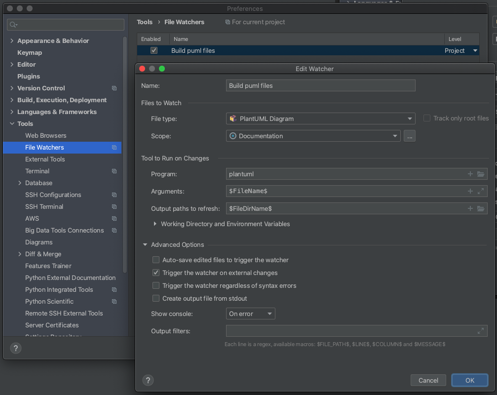
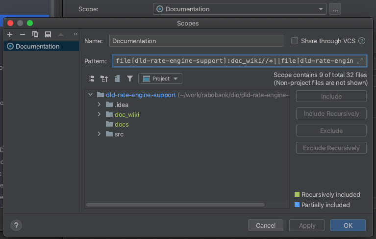

# Scala 101 - an introduction to Scala, SBT, and ScalaTest

## Student notes
Preparations for attending the course:
1. Install SBT
   * `brew install sbt` (or use your personal preferred way to install software on your Macbook)
   * Check if you can use sbt by doing an `sbt --version`
1. Set up an IDE of your choice. IntellIJ is recommended, VSCode is possible too
   * IntellIJ
     * IntellIJ has support for scala and sbt through the Scala plugin provided by JetBrains
       * Install the plugin via IntellIJ->Preferences... and then go to Plugins>Marketplace and search for Scala
       * sbt commands can be run from the IDE, or from the command line
   * VSCode
     * VSCode supports scala via an extension from Scalameta, called scalameta language server, or Metals
     * No sbt built-in
       * sbt commands are run from Terminal instead
3. Clone this repository

### More resources
* https://docs.scala-lang.org/overviews/collections/performance-characteristics.html
* https://www.udemy.com/course/rock-the-jvm-scala-for-beginners/ - highly recommended beginners training
* https://www.coursera.org/specializations/scala - 4 courses that teach you how to become a Scala developer and use Spark to perform
  big data analysis
* ...

## Instructor notes
To see the slides:
* open a command line
* `cd` to the slides folder
* `python3 -m http.server`
* Open a browser tab and navigate to `localhost:8000`

When working on the slides, make sure you disable cache in your browser and reload the slides whenever you saved changes, otherwise
you may not see the most recent version of the slides.

## Working on the slides
To make authoring the documentation easy, you should add some plugins and setup to IntelliJ. This will help working
with PlantUML diagrams (you see live results on diagram edits in IntelliJ, and a File Watcher takes care of updating
the `png` versions of all modified diagrams).

1. Install the PlantUML plugin and follow their instructions on setting up PlantUML and Graphviz
2. Install the File Watchers plugin
1. Add a File Watcher to watch the `slides` folder and process `puml` files in these folders: 
   
1. Create a custom `scope` to limit the file watcher: 
   

Automatically generate .png results from changed .puml files:
* install File Watcher plugin in IntelliJ
* See https://www.jetbrains.com/help/idea/using-file-watchers.html#ws_file_watchers_bedore_you_start for background info
